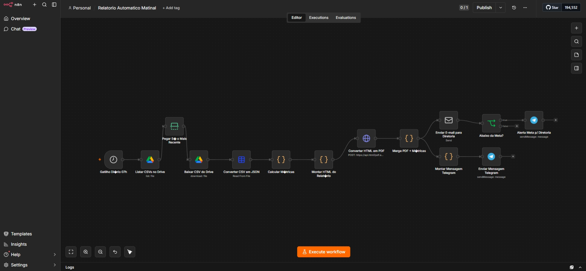

# Relatório Automático Matinal de Vendas

Pipeline de inteligência comercial que gera e distribui relatórios executivos de vendas todos os dias às 7h, de forma 100% automática.

## Tecnologias

`n8n` · `Google Drive` · `Google Sheets` · `HTML2PDF API` · `Gmail` · `Telegram`

## Como funciona

O sistema lê o CSV de vendas mais recente no Google Drive, calcula métricas como faturamento, ticket médio, top produtos e melhor vendedor, gera um relatório executivo em PDF com visual profissional e envia para a diretoria por e-mail.

Simultaneamente, a equipe recebe um resumo motivacional no Telegram. Se a meta diária não foi atingida, um alerta adicional é disparado automaticamente para a gestão tomar ação.

## Resultado

> A diretoria começa o dia já informada sobre o desempenho da operação, sem depender de nenhuma pessoa para montar ou enviar o relatório — economizando tempo e garantindo que nenhum dado seja esquecido.

---

Desenvolvido por [Jackson Santana](https://jacksonsantanaxcode-x.github.io/portifolio/)
